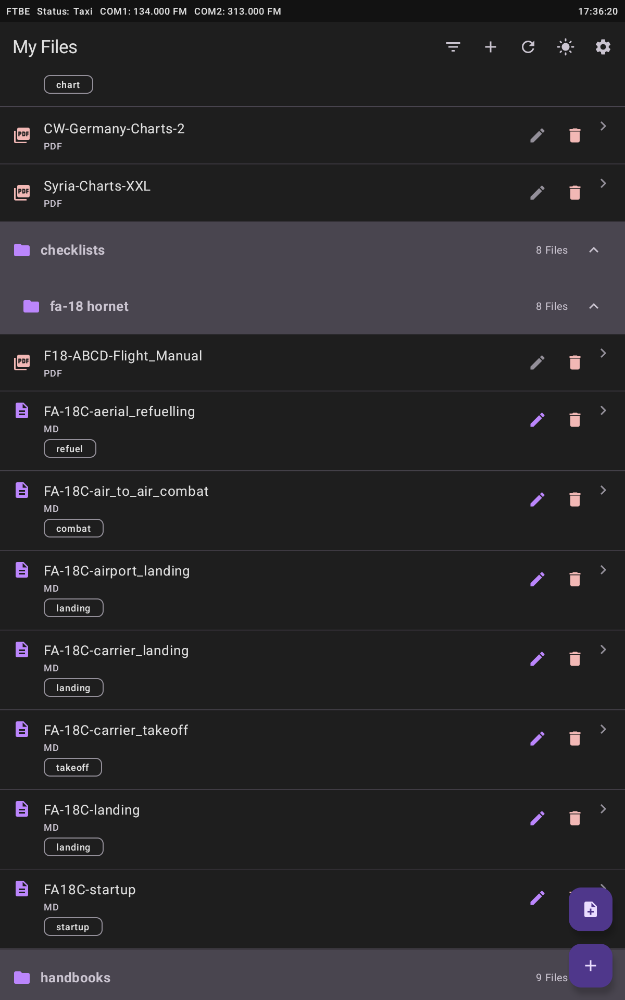
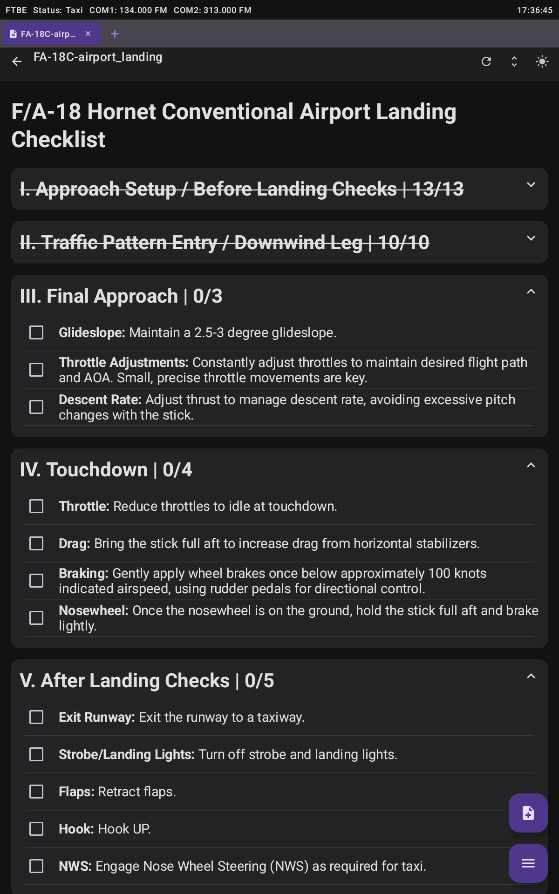
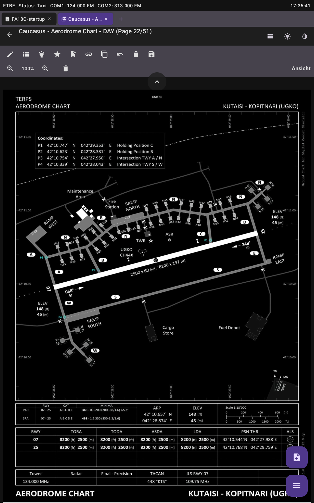
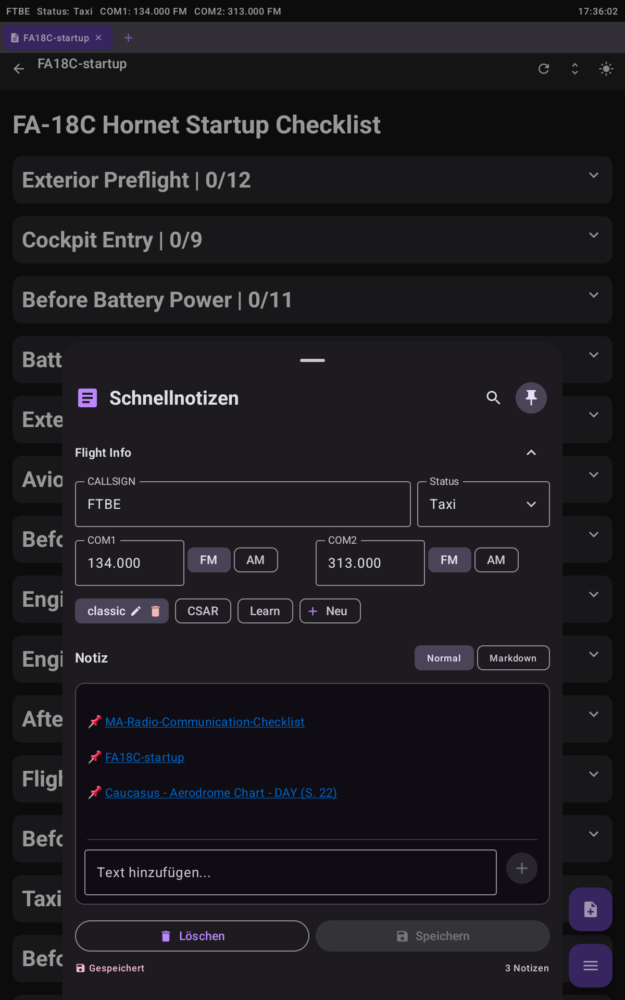

<!-- Badges -->
<p align="left">
	
	
	
	
</p>


<div align="center">
	<a href="CHANGELOG.md">Changelog</a> |
	<a href="docs/docnavigation.md">Documentation</a> |
	<a href="docs/FUTURE_PLANS.md">Future Plans</a> |
	<a href="SECURITY.md">Security Policy</a> |
	<a href="LICENSE">License</a> |
	<a href="COLLABORATORS.md">Collaborators</a>
</div>


# InteractiveChecklists

InteractiveChecklists is an Android application for viewing and interacting with Markdown and PDF checklists. It is built with Jetpack Compose and follows an MVVM-style architecture.

> **Development status:** This repository is a development version and not an official release. The app is functional but under active development and may contain experimental features.

**Table of Contents**

- [Features](#features)
- [Screenshots](#screenshots)
- [Installation](#installation)
- [System Requirements](#system-requirements)
- [How to Build & Run](#how-to-build--run)
- [Key Components](#key-components)
- [Contributing](#contributing)
- [Roadmap](#roadmap)
- [Support & Contact](#support--contact)
- [FAQ](#faq)
- [Acknowledgements & Credits](#acknowledgements--credits)
- [License](#license)


## Features

- **Unified File System:** Manage files from bundled assets and internal storage in a single hierarchical view.
- **Multi-Tab System:** Open multiple documents (MD/PDF) with a scrollable tab bar, quick tab switcher, swipe navigation, and tab persistence.
- **PDF Viewer:** PDF viewer with annotations (draw/highlight/erase), pinch-to-zoom, page snapping, and color inversion.
- **Interactive Markdown Checklists:** Stateful checkboxes and collapsible sections for interactive checklists.
- **Tagging System:** Assign tags to files for filtering and organization.
- **QuickNotes:** Persistent notes powered by Room, with search, autosave, and markdown support.
- **Data Persistence:** Stores user preferences, annotations, shortcuts, tags, and open tabs locally.


## Screenshots

<p align="center">
		
		
		
		
</p>


## Installation

Step-by-step instructions to get the project running locally.

1. Prerequisites
	 - Install Android Studio (Arctic Fox or later recommended).
	 - Install a compatible JDK (Java 11 or later recommended).
	 - Configure Android SDK and at least one emulator or use a physical device.

2. Clone the repository

```bash
git clone https://github.com/<your-org>/ChecklistInteractive.git
cd ChecklistInteractive
```

3. Build with Gradle (command-line)

```bash
./gradlew assembleDebug
```

4. Open in Android Studio
	 - Open the `ChecklistInteractive` directory in Android Studio.
	 - Let Gradle sync and allow Android Studio to download any missing SDK components.
	 - Run the app on an emulator or connected device.


## System Requirements

- Supported OS: Windows, macOS, Linux (for development).
- Android Studio: Arctic Fox or newer recommended.
- JDK: Java 11+ recommended.
- Android SDK: API level corresponding to the project's `compileSdk` and `targetSdk` (see `build.gradle.kts`).


## How to Build & Run

- From Android Studio: Open the project, wait for Gradle to finish syncing, then select a target device and click **Run**.
- From the command line: `./gradlew assembleDebug` builds an APK; use `./gradlew installDebug` to install on a connected device.


## Key Components

- `MainActivity.kt`: App entry point and navigation orchestration.
- `data/files/InternalFileManager.kt`: Unified file management.
- `ui/files/InternalFilesScreen.kt`: File browser and tagging UI.
- `ui/checklist/MarkdownViewer.kt`: Interactive markdown checklist viewer.
- `ui/checklist/PdfViewer.kt`: PDF viewer and annotation tools.
- `data/quicknotes/QuickNoteManager.kt`: QuickNotes data layer.


## Contributing

We welcome contributions. For guidelines, issue workflow, and coding standards, see [COLLABORATORS.md](COLLABORATORS.md).

Quick contribution ideas:
- Improve documentation or add examples.
- Add or extend tests.
- Fix small UI/UX bugs or accessibility issues.

For larger or breaking changes, please open an issue first to discuss design and scope.


## Roadmap

Planned features and long-term improvements are tracked in the [FUTURE_PLANS](docs/FUTURE_PLANS.md) document.


## Support & Contact

If you encounter issues or have questions:

- Open an issue in this repository.
- For security-sensitive issues, please follow the instructions in [SECURITY.md](SECURITY.md).
- For contribution coordination and discussions, see [COLLABORATORS.md](COLLABORATORS.md).


## FAQ

- Q: How do I run tests?
	- A: There are unit tests under `app/src/test`. Run them via `./gradlew test`.
- Q: What is the license?
	- A: This project is licensed under CC-BY-NC-SA 4.0. See the `LICENSE` file for details.
- Q: Where is the documentation?
	- A: See the `docs/` folder or the [Documentation index](docs/docnavigation.md).


## Acknowledgements & Credits

Thanks to all contributors and to the Jetpack Compose and Android open-source ecosystems used in this project.


## License

This project is licensed under the terms in the `LICENSE` file (CC BY-NC-SA 4.0).


