<!-- Badges -->
<p align="left">
  

  <a href="https://github.com/arn-c0de/InteractiveChecklists">
    
  </a>

  <a href="https://deepwiki.com/arn-c0de/InteractiveChecklists">
    
  </a>

  <strong>APP</strong>
  
  
  

  <br/>

  <strong>PYTHON TOOLS</strong>
  
  
</p>


<div align="center">
	<a href="README.md">English</a> |
	<a href="/docs/ZH/README_zh.md">Chinese (Simplified)</a>
</div>

<div align="center">
	<a href="CHANGELOG.md">Changelog</a> |
	<a href="docs/EN/docnavigation.md">Documentation</a> |
	<a href="docs/EN/planning/roadmap.md">Roadmap</a> |
	<a href="SECURITY.md">Security Policy</a> |
	<a href="LICENSE">License</a> |
	<a href="COLLABORATORS.md">Collaborators</a>
</div>

<div align="center">
	<a href="THIRD_PARTY_LICENSES.md">Third-Party Licenses</a>
</div>

<p align="center">
	<a href="#screenshots">Screenshots</a> • <a href="#demo-videos">Demo Videos</a>
</p>


# InteractiveChecklists

InteractiveChecklists is an Android application for viewing and interacting with Markdown and PDF checklists. It is built with Jetpack Compose and follows an MVVM-style architecture.

> **Development status:** This repository is a development version and not an official release. The app is functional but under active development and may contain experimental features.

> **Note:** A preview APK for version 1.1 is planned. If you are not familiar with Android Studio or building apps from source, please wait for the official preview release to test the app.


**Table of Contents**

- [Features](#features)
- [Screenshots](#screenshots)
- [Demo Videos](#demo-videos)
- [Installation](#installation)
- [System Requirements](#system-requirements)
- [How to Build & Run](#how-to-build--run)
- [Key Components](#key-components)
- [Contributing](#contributing)
- [Support & Contact](#support--contact)
- [FAQ](#faq)
- [Acknowledgements & Credits](#acknowledgements--credits)
- [License](#license)


## Features

- **Unified File System:** Manage files from bundled assets and internal storage in a single hierarchical view.
- **Multilanguage Support:** The app supports English, Spanish and German. You can switch the language in the Settings menu. All UI text is available in English.
- **Multi-Tab System:** Open multiple documents (MD/PDF) with a scrollable tab bar, quick tab switcher, swipe navigation, and tab persistence.
- **PDF Viewer:** PDF viewer with annotations (draw/highlight/erase), pinch-to-zoom, page snapping, and color inversion.
- **Interactive Markdown Checklists:** Stateful checkboxes and collapsible sections for interactive checklists.
- **Tagging System:** Assign tags to files for filtering and organization.
- **QuickNotes:** Persistent notes powered by Room, with search, autosave, and markdown support.
- **Data Persistence:** Stores user preferences, annotations, shortcuts, tags, and open tabs locally.
- **Aviation Map (experimental):** OpenStreetMap-based map viewer with live aircraft position tracking from the DataPad stream. Adds a `MapViewer` tab showing aircraft position, heading, altitude and basic overlays — see [docs/EN/features/AVIATION_MAP_FEATURE.md](docs/EN/features/AVIATION_MAP_FEATURE.md) for details and configuration.
- **DataPad (experimental):** Live flight telemetry display (UDP) for DCS World. Streams aircraft telemetry to the app for realtime status and popup details — see [docs/EN/features/DATAPAD_FEATURE.md](docs/EN/features/DATAPAD_FEATURE.md) for full details and setup instructions.
- **Tactical Units Tracking (experimental):** Live tactical unit markers (aircraft, helicopter, ground, ship) on the map with real-time updates. Marker popups include **"Last seen"** timestamps and refresh snippets with speed/altitude. A **"Live Units Only"** filter (shows units seen in the last 10s) is synchronized between the list and the map. See [docs/EN/features/TACTICAL_UNITS_TRACKING.md](docs/EN/features/TACTICAL_UNITS_TRACKING.md) and [scripts/DCS-SCRIPTS-FOLDER-Experimental/README_ENTITY_TRACKING.md](scripts/DCS-SCRIPTS-FOLDER-Experimental/README_ENTITY_TRACKING.md) for setup and details.
- **MapDatabaseTools (Python):** A collection of Python utilities for receiving, decrypting (AES-GCM), and visualizing DCS flight telemetry. Includes a PySide6 GUI with an embedded OpenStreetMap/Leaflet map for live aircraft tracking, a marker database, and helper scripts to manage map assets. See `scripts/MapDatabaseTools/README.md` for usage and configuration.

- **Supported maps (marker DB):**

| Map | Status | Notes |
| --- | --- | --- |
| Caucasus | Supported | Marker set available in DB |
| Marianas | Supported | Marker set available in DB |
| Germany (CW) | mostly Supported | Marker addition in progress |


Here is the **integrated, cleaned-up, and consistent Markdown version**, with the **“Unblocking Files in DCS World”** section properly embedded in a logical place. Language is corrected and suitable for a README / manual.


## Quick Start – Windows (Recommended & Easiest)

### Install the DCS Export Script (Required)

Copy `export.lua` from  
`scripts/DCS-SCRIPTS-FOLDER-Experimental`  

into your DCS scripts folder, for example:  
`%USERPROFILE%\Saved Games\DCS\Scripts\`

This script enables DCS to write **entity batches** and **player telemetry files** into a subfolder that the Python forwarder reads.

After copying:
- Start or reload your mission, **or**
- Restart DCS  

to activate the export script.

---

### Important Note – Python Requirement

The Python forwarder (**DataPad Server**) requires a **local Python installation (3.8 or newer)**.

- On Windows, installing Python via the **Microsoft Store** is recommended for simplicity.
- The included `install.bat`:
  - Creates a **virtual environment (venv)**
  - Installs all required Python packages into that environment

This keeps dependencies isolated and clean.

- To update or reinstall packages: re-run `install.bat`
- To remove everything: delete the created `venv` folder

---

### Initial Setup

1. Navigate to the folder:  
   `/DCS-SCRIPTS-FOLDER-Experimental`

2. **One-time setup** – double-click:  
   `install.bat`  
   → Wait **1–2 minutes** while required packages are installed  
   *(only needed once or when updating packages)*

3. Start the server – double-click:  
   `run.bat`  
   → A small console window / menu will open

---
<p align="center">
	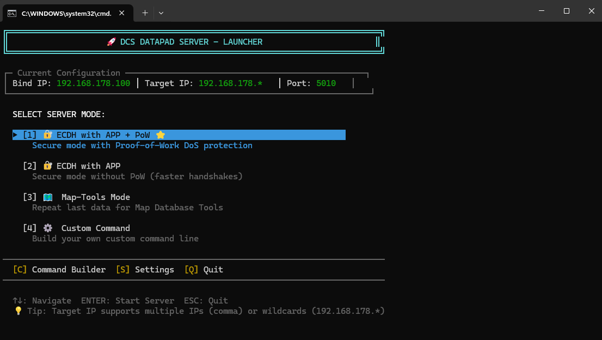<br/>
	<em>DataPad server launcher with configuration menu</em>
</p>

## 4. Server Setup

- Enter the **Server IP address**, **Target IP(s)**, and enable **PoW** *(recommended)*  
  - Configure this via the **Settings menu** by pressing **[S]**
  - Or edit the auto-generated **`server_config.json`** located next to `start.bat`

### Notes

- **Server IP address**  
  → IP of the **PC where DCS is running**
- **Target IPs**  
  → Android devices (tablet or smartphone) in your Wi-Fi network
- You can:
  - Enter each target IP individually, **or**
  - Allow all devices in your network using `.*` at the end of the IP address  
    - Example: `192.168.1.*`

### Start the Server

- Press **Enter** to confirm the settings
- Select the **server mode** using the **arrow keys**
  - **Recommended:** **ECDH with App + PoW**
    - Easiest to set up
    - Secure and safe for automatic pairing
- Press **Enter** to start the server

---

### QR Code Pairing

<p align="center">
	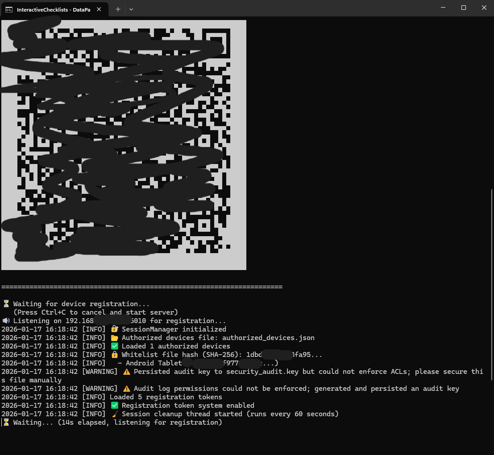<br/>
	<em>DataPad server QR-code generation for authorized_devices.json </em>
</p>

6. In the server window:
   - Press **B** within **5 seconds**
     → A **QR code** will be displayed automatically
   - *(Optional)* You can also configure IP/port manually

---

## 5. Android App Setup
<p align="center">
	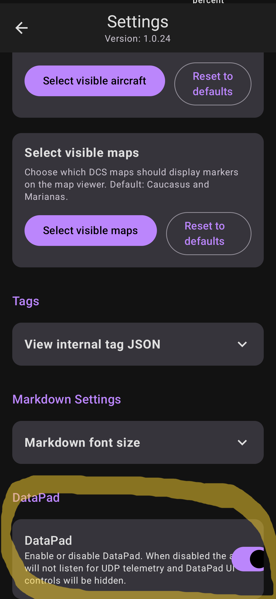<br/>
	<em>Activates the in App datapad functions</em>
</p>

1. Open the Android app
2. Go to **Settings → DataPad**
3. Turn **DataPad ON**

<p align="center">
	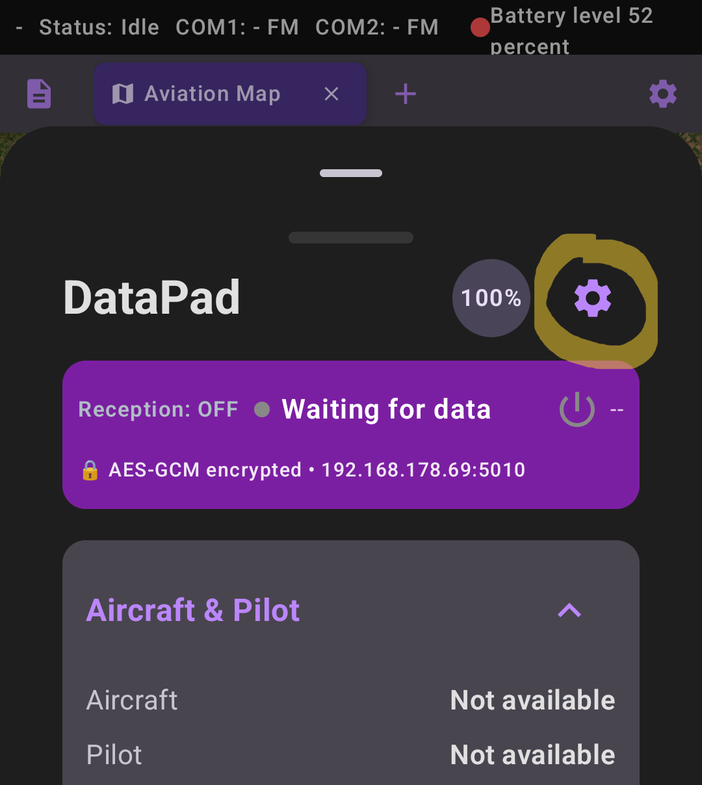<br/>
	<em>Settings Menu for datapad</em>
</p>

4. Open the **DataPad Popup** using the **FAB button**
5. Tap **Settings** in the **DataPad Popup**

<p align="center">
	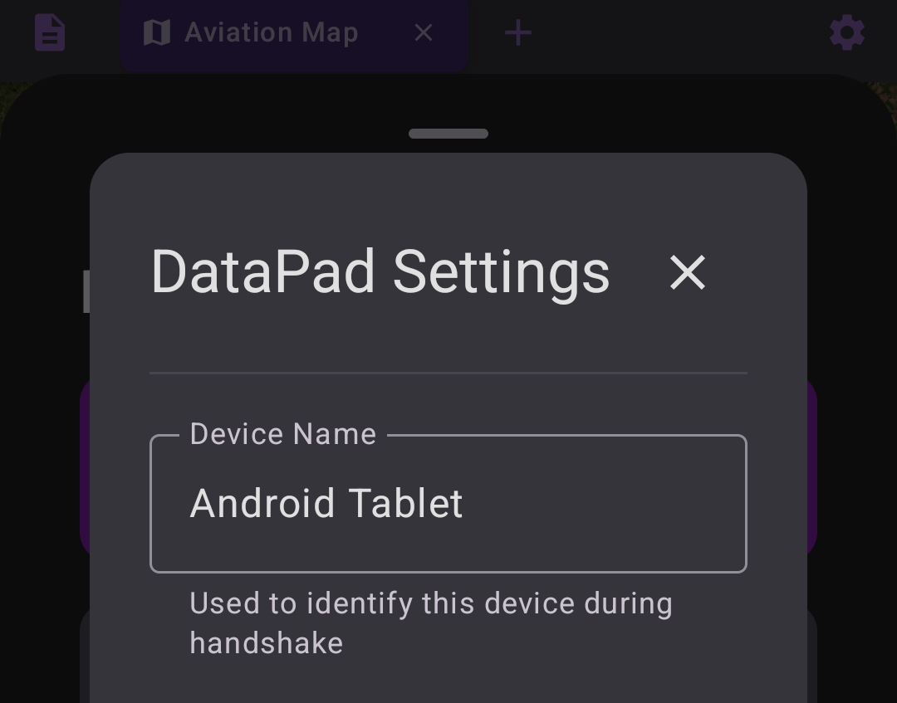<br/>
	<em>Enter your Device Name</em>
</p>

6. Enter a Device name
   
<p align="center">
	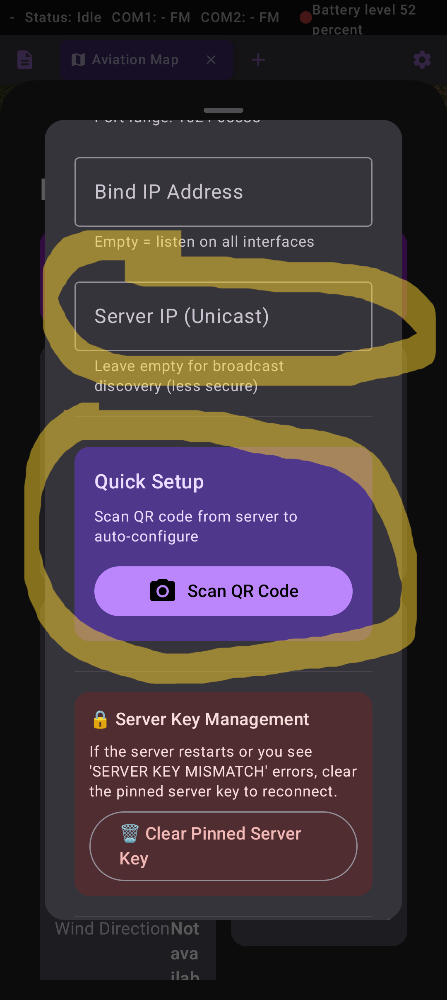<br/>
	<em>Enter your Server IP and Scan QR-Code</em>
</p>

7. Scroll down set your **ServerIP** (recommend) then to **QR-Code setup** | or for Manual adding, copy Device Name, ID and Public Key and enter as new entry in authorized_devices.json
8. Tap **Scan QR Code**
9. Scan the QR code displayed on your PC screen  
   - *(First time only – securely registers your device)*
10. Enable the **toggle button** in the **DataPad Popup**
   - If the correct server is selected, a **heartbeat is sent every 30 seconds**

---

## Data Status & Indicators

- When a **DCS mission starts** and you are **seated in an aircraft**, the **forwarder (DataPad Server)** begins sending live data to the app
- The current status is shown in the **top info bar**:

  - 🔴 **Red** – No incoming data / No mission running  
  - 🟡 **Yellow** – Mission running, but not in an aircraft / No active live data  
  - 🟢 **Green** – In an aircraft and receiving **telemetry and/or tactical unit live data**

---

## Unblocking Files in DCS World (Important)

Some DCS files may be blocked by **Group Policy** or **antivirus software**.  
This can prevent correct operation.

### Using PowerShell (Recommended)

1. Press the **Windows key** and type `PowerShell`
2. Right-click **Windows PowerShell** → **Run as Administrator**
3. To unblock a single file, enter:

```powershell
Unblock-File "C:\Program Files\Eagle Dynamics\DCS World\bin\lua-dxgui.dll"


4. Press **Enter**

### To Unblock All DLL Files at Once

```powershell
Get-ChildItem "C:\Program Files\Eagle Dynamics\DCS World\bin\*.dll" | Unblock-File
```

Press **Enter**.

---

### Alternative: Repair DCS

If unblocking does not help:

1. Open **DCS Launcher**
2. Go to **Settings** (gear icon)
3. Click **Repair**
4. Wait for the process to complete

This will restore and unblock all affected files.

---

✅ **Done!**
The app should now receive **live telemetry and tactical data** from DCS.


### Security – Quick Summary (2025/2026)

- Connection is encrypted (AES-256 + ECDH handshake) – similar to secure websites  
- Only registered devices can connect (via QR code or manual list)  
- First connection is remembered (Trust on First Use) → protects against fake servers later  
- Optional extra protection: Proof-of-Work (anti-spam) – can be turned on in `run.bat` menu if needed  

For most users the **QR code method** is secure enough and very simple.


### For Linux/macOS or advanced users (manual start)

If you don't use Windows or want full control:

```bash
cd scripts/DCS-SCRIPTS-FOLDER-Experimental
python -m venv venv
source venv/bin/activate          # Linux/macOS
# or on Windows: venv\Scripts\activate
pip install -r requirements.txt
python forward_parsed_udp.py --authorized-devices authorized_devices.json --host YOUR_PC_IP --port 5010
```


Entity Contacts (tactical units): Enable **Entity Tracking** and run the forwarder with entity tracking enabled to receive live markers; see [scripts/DCS-SCRIPTS-FOLDER-Experimental/README_ENTITY_TRACKING.md](scripts/DCS-SCRIPTS-FOLDER-Experimental/README_ENTITY_TRACKING.md) and [docs/EN/features/TACTICAL_UNITS_TRACKING.md](docs/EN/features/TACTICAL_UNITS_TRACKING.md).

See [docs/EN/features/DATAPAD_FEATURE.md](docs/EN/features/DATAPAD_FEATURE.md) for full usage, configuration, and troubleshooting.

**Phase 1 (experimental)**: This is Phase 1 of DataPad — future phases will add more telemetry, visualizations, and security improvements.

**Next up:** 2-way communication (experimental) to enable data flow back to DCS.

## Screenshots

<p align="center">
	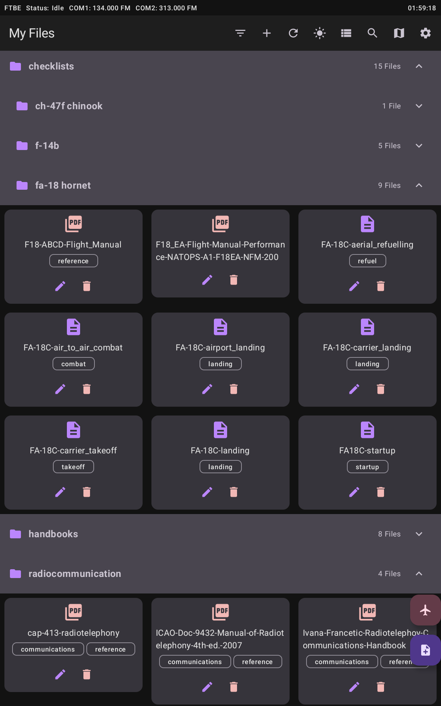<br/>
	<em>File explorer showing the hierarchical file and folder structure</em>
</p>

<p align="center">
	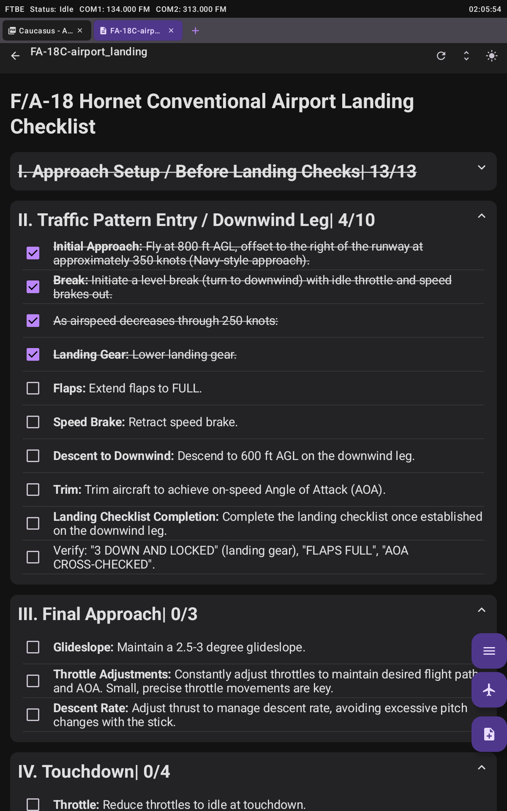<br/>
	<em>Interactive Markdown checklist with stateful checkboxes</em>
</p>

<p align="center">
	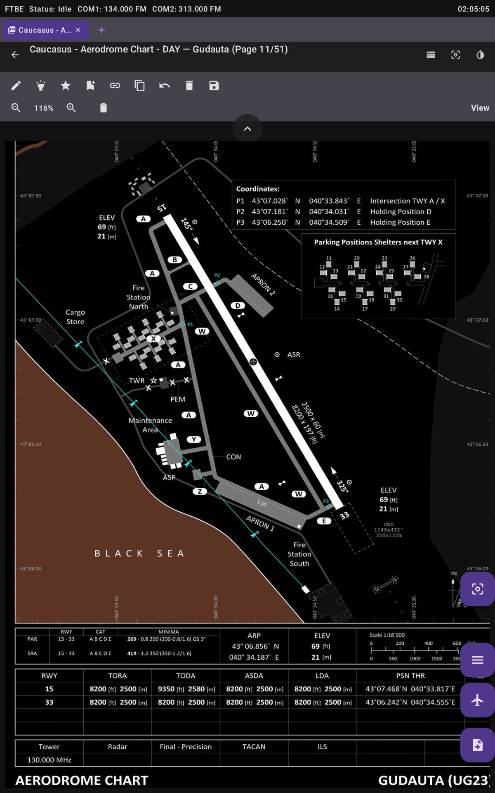<br/>
	<em>PDF viewer with drawing, highlighting and annotation capabilities</em>
</p>

<p align="center">
	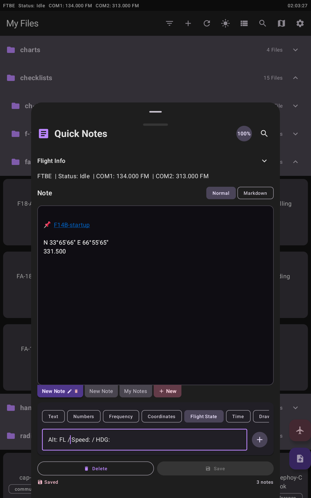<br/>
	<em>QuickNotes editor with markdown support and autosave</em>
</p>

<p align="center">
	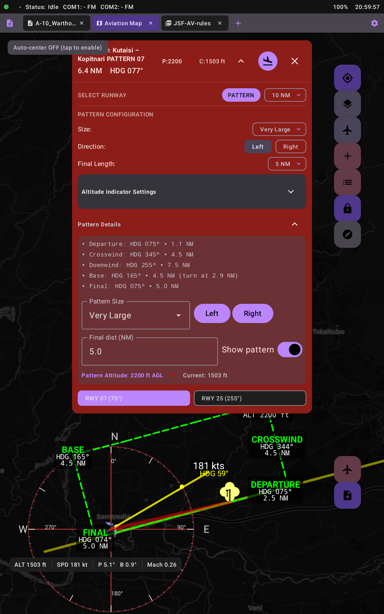<br/>
	<em>Landing pattern calculator displaying flight path calculations</em>
</p>

<p align="center">
	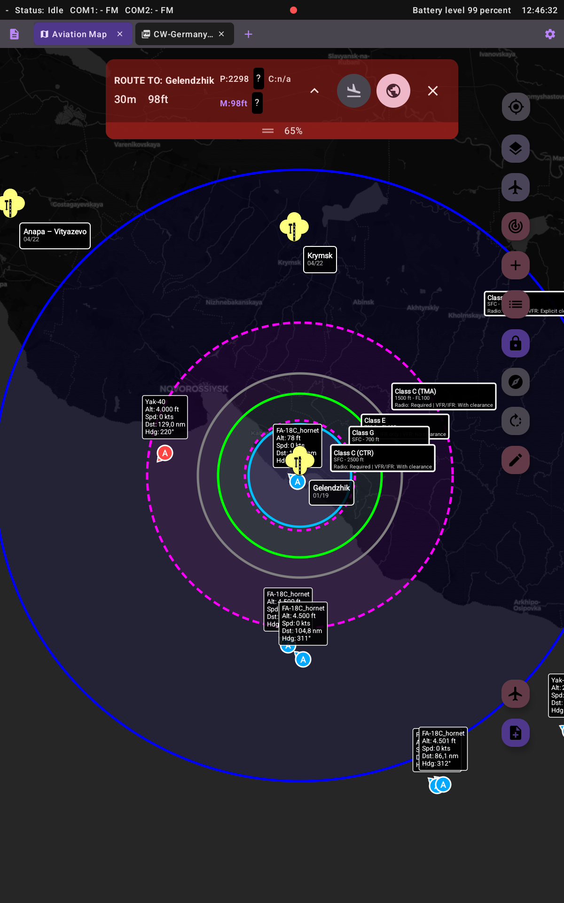<br/>
	<em>Early ATC features showing airspace visualization</em>
</p>

<p align="center">
	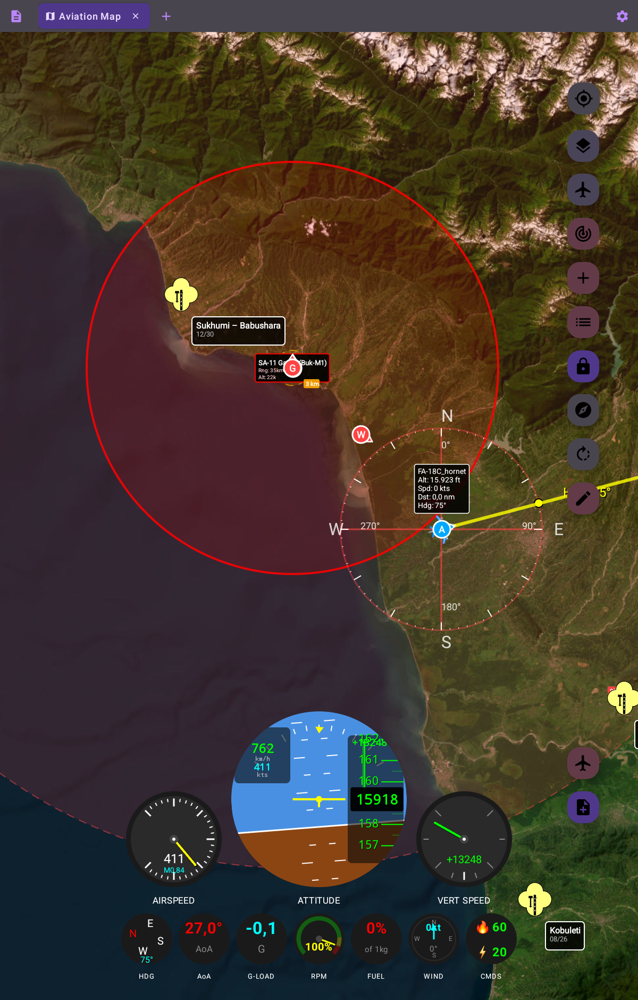<br/>
	<em>AA range rings visualization</em>
</p>

<p align="center">
	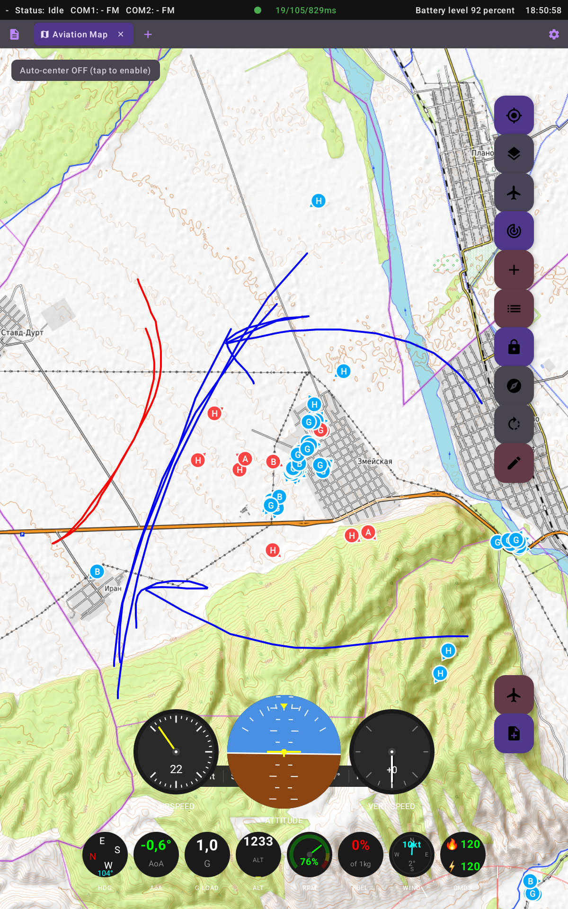<br/>
	<em>Live tactical markers displaying real-time unit positions</em>
</p>

<p align="center">
	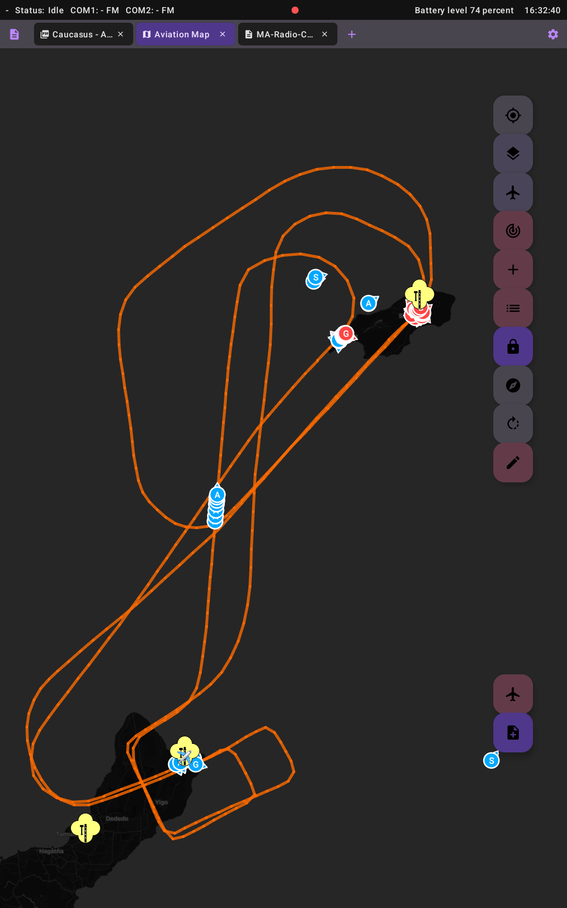<br/>
	<em>Flight path tracking overlay on the aviation map</em>
</p>

<p align="center">
	<br/>
	<em>Route planning with labeled waypoints and flight paths</em>
</p>

<p align="center">
	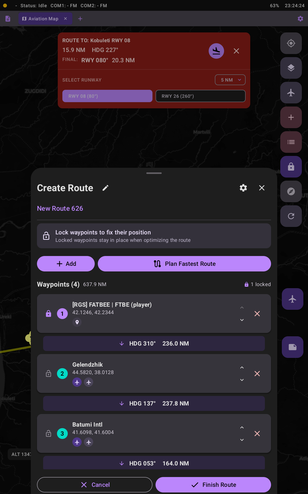<br/>
	<em>Route planner interface with live preview</em>
</p>

<p align="center">
	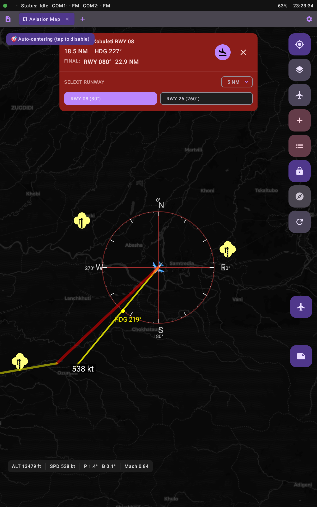<br/>
	<em>Landing route creation sheet with configuration options</em>
</p>

<p align="center">
	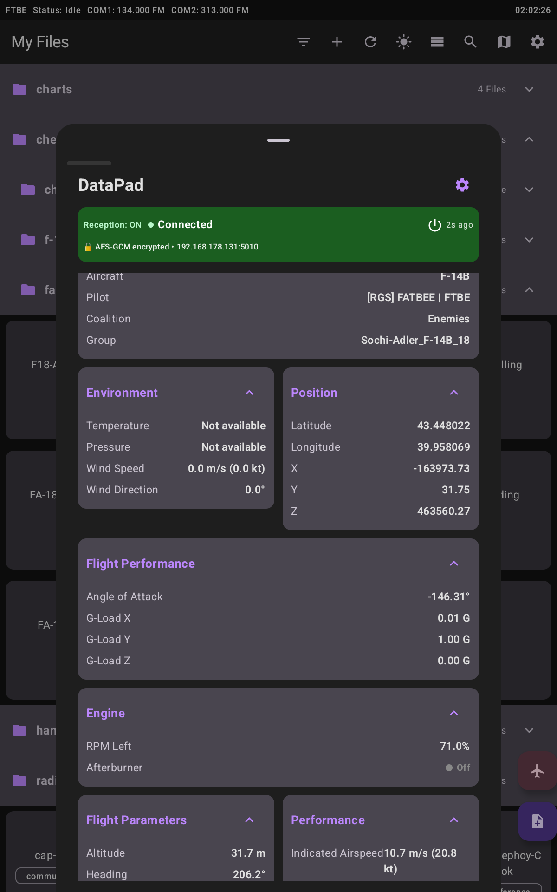<br/>
	<em>DataPad displaying live aircraft telemetry from DCS World</em>
</p>

<p align="center">
	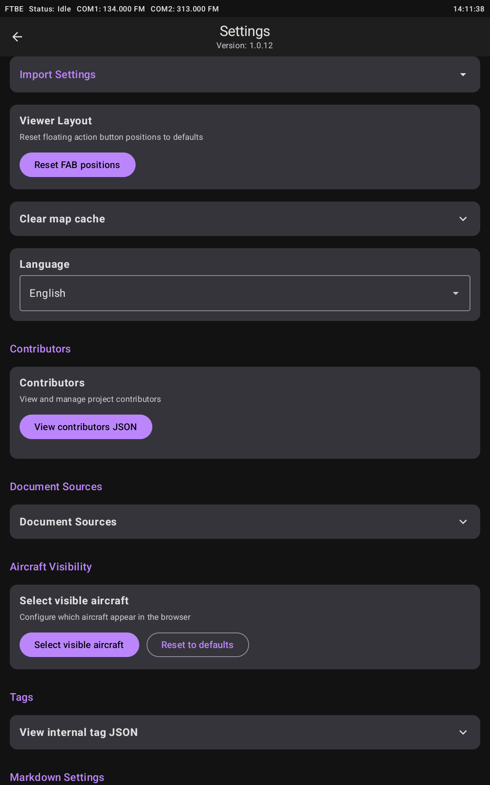<br/>
	<em>Application settings and configuration panel</em>
</p>


<a name="demo-videos"></a>
## Demo Videos 🎬

<p align="center">
<a href="https://youtu.be/ecE6bdzyNwA"></a> &nbsp;
<a href="https://youtu.be/V7vRuQvTFK8"></a> &nbsp;
<a href="https://youtu.be/G5uiONmqxe0"></a>
</p>

<p align="center">
</p>

> 📝 **NOTE**  
> This is a test recording to evaluate recording performance, tablet capture workflow, resolution settings, and overall system stability during DCS gameplay. Mission content and pacing are deliberately simple and functional.

## Installation

Step-by-step instructions to get the project running locally.

1. Prerequisites
	 - Install Android Studio (Arctic Fox or later recommended).
	 - Install a compatible JDK (Java 11 or later recommended).
	 - Configure Android SDK and at least one emulator or use a physical device.
	 - For Python forwarder scripts (optional): install `qrcode` and cryptography dependencies: `pip install qrcode[pil] cryptography cffi` (use a virtual environment to avoid system conflicts).

2. Clone the repository

```bash
git clone https://github.com/arn-c0de/InteractiveChecklists.git
cd InteractiveChecklists
```

3. Build with Gradle (command-line)

```bash
./gradlew assembleDebug
```

4. Open in Android Studio
	 - Open the `InteractiveChecklists` directory in Android Studio.
	 - Let Gradle sync and allow Android Studio to download any missing SDK components.
	 - Run the app on an emulator or connected device.


## System Requirements

- Supported OS: Windows, macOS, Linux (for development).
- Android Studio: Arctic Fox or newer recommended.
- JDK: Java 11+ recommended.
- Android SDK: API level corresponding to the project's `compileSdk` and `targetSdk` (see `build.gradle.kts`).


## How to Build & Run

- From Android Studio: Open the project, wait for Gradle to finish syncing, then select a target device and click **Run**.
- From the command line: `./gradlew assembleDebug` builds an APK; use `./gradlew installDebug` to install on a connected device.


## Key Components

- `MainActivity.kt`: App entry point and navigation orchestration.
- `data/files/InternalFileManager.kt`: Unified file management.
- `ui/files/InternalFilesScreen.kt`: File browser and tagging UI.
- `ui/checklist/MarkdownViewer.kt`: Interactive markdown checklist viewer.
- `ui/checklist/PdfViewer.kt`: PDF viewer and annotation tools.
- `data/quicknotes/QuickNoteManager.kt`: QuickNotes data layer.


## Contributing

We welcome contributions. For guidelines, issue workflow, and coding standards, see [COLLABORATORS.md](COLLABORATORS.md).

Quick contribution ideas:
- Improve documentation or add examples.
- Add or extend tests.
- Fix small UI/UX bugs or accessibility issues.

For larger or breaking changes, please open an issue first to discuss design and scope.


## Roadmap

Planned features and long-term improvements are tracked in the [Roadmap](docs/EN/planning/roadmap.md) document.


## Support & Contact

If you encounter issues or have questions:

- Open an issue in this repository.
- For security-sensitive issues, please follow the instructions in [SECURITY.md](SECURITY.md).
- For contribution coordination and discussions, see [COLLABORATORS.md](COLLABORATORS.md).


## FAQ

- Q: How do I run tests?
	- A: There are unit tests under `app/src/test`. Run them via `./gradlew test`.
- Q: What is the license?
	- A: This project is licensed under CC-BY-NC-SA 4.0. See the `LICENSE` file for details.
- Q: Where is the documentation?
	- A: See the `docs/` folder or the [Documentation index](docs/EN/docnavigation.md).


## Acknowledgements & Credits

Thanks to all contributors and to the Jetpack Compose and Android open-source ecosystems used in this project.

[](https://github.com/arn-c0de/InteractiveChecklists/graphs/contributors)


## License

This project is licensed under the terms in the `LICENSE` file (CC BY-NC-SA 4.0).


