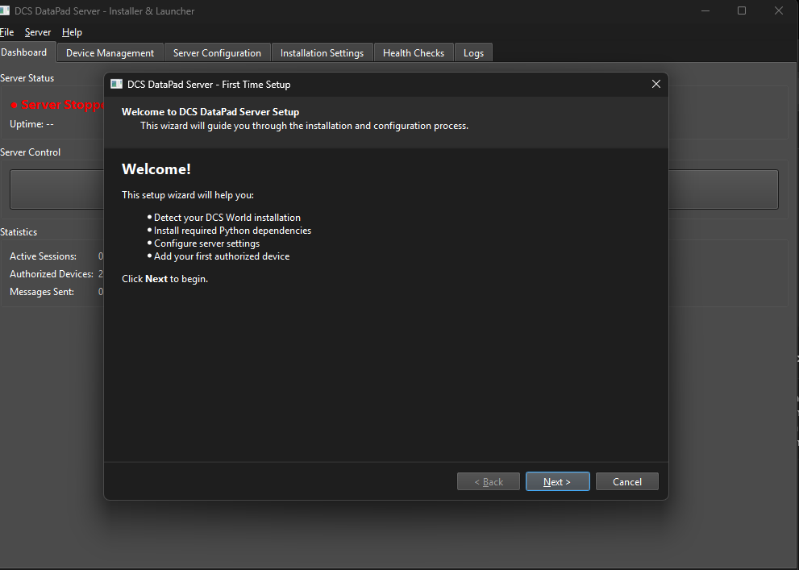
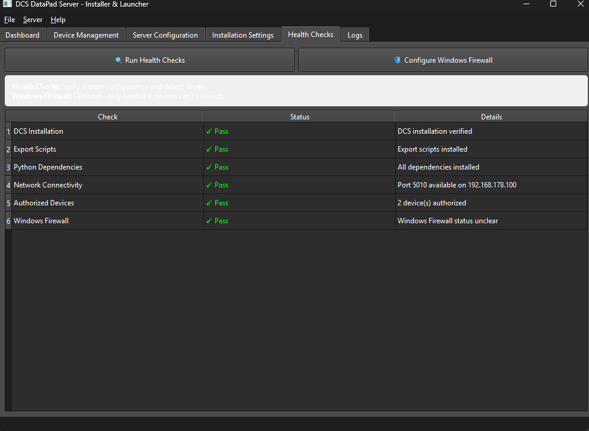
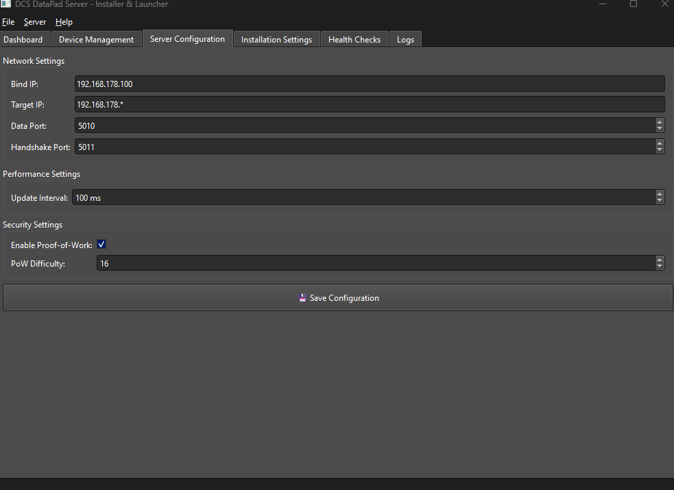
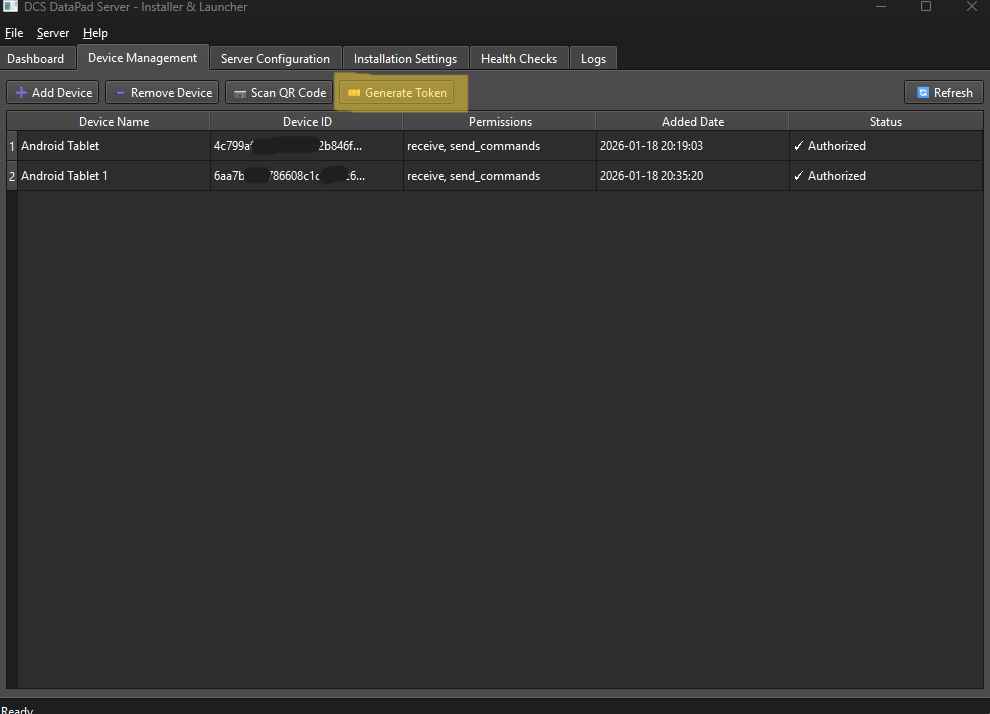
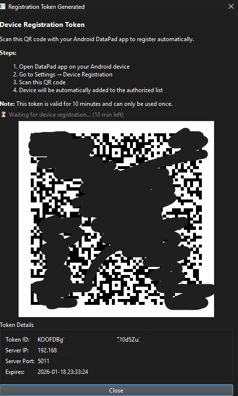
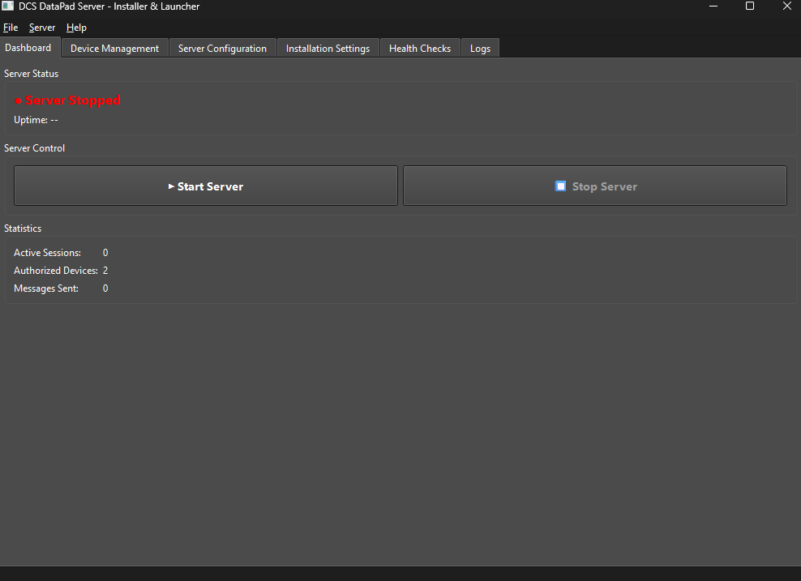

<!-- Badges -->
<p align="left">
	<a href="https://github.com/arn-c0de/InteractiveChecklists"></a>
	<a href="https://deepwiki.com/arn-c0de/InteractiveChecklists"></a>
	
	
	
	
</p>


<div align="center">
	<a href="../../CHANGELOG.md">Changelog</a> |
	<a href="../EN/docnavigation.md">Documentation</a> |
	<a href="../EN/planning/roadmap.md">Roadmap</a> |
	<a href="../../SECURITY.md">Security Policy</a> |
	<a href="../../LICENSE">License</a> |
	<a href="../../COLLABORATORS.md">Collaborators</a>
</div>

<div align="center">
	<a href="../../THIRD_PARTY_LICENSES.md">Third-Party Licenses</a>
</div>

<p align="center">
	<a href="#screenshots">Screenshots</a> • <a href="#demo-videos">Demo Videos</a>
</p>

<div align="center">
	<a href="../../README.md">英语</a> |
	<a href="README_zh.md">中文</a>
</div>


# InteractiveChecklists

InteractiveChecklists 是一款用于查看与操作 Markdown 及 PDF 清单的 Android 应用。本应用使用 Jetpack Compose 构建，遵循 MVVM-style 架构。
它设计为可扩展的交互式航空地图，具有实时 DCS 数据集成、战术标记和动态航线及进近模式计算功能。
基于跑道方向的进近可视化和实时地图更新可增强飞行操作期间的态势感知能力。


> **开发状态:** 此代码库为开发版本，并非正式发布。应用程序功能可用，但正处于积极开发中，可能包含实验性功能。

> **注意:** 计划提供 1.1 版本的预览版 APK。如果您不熟悉 Android Studio 或从源代码构建应用程序，请等待官方的预览版发布后再进行测试。

**目录**

- [功能特性](#features)
- [截图](#screenshots)
- [演示视频](#demo-videos)
- [安装](#installation)
- [系统要求](#system-requirements)
- [如何构建与运行](#how-to-build--run)
- [核心组件](#key-components)
- [贡献指南](#contributing)
- [支持&联系](#support--contact)
- [常见问题](#faq)
- [致谢&鸣谢](#acknowledgements--credits)
- [许可证](#license)


## 功能特性

- **统一文件系统:** 在单一层次视图中管理来自内置资源和内部存储的文件。
- **多语言支持:** 本应用支持英语、西班牙语和德语。您可以在设置菜单中切换语言。所有 UI 文本均有英文版本。
- **多标签系统:** 通过可滚动的标签栏、快速标签切换器、滑动导航和标签持久化，打开多个文档（MD/PDF）。
- **PDF 查看器:** 支持标注（绘制/高亮/擦除）、捏合缩放、页面对齐和颜色反相的 PDF 查看器。
- **交互式 Markdown 清单:** 用于交互式清单的有状态复选框和可折叠区域。
- **标签系统:** 为文件分配标签以便筛选和组织。
- **快速笔记:** 由 Room 提供支持的持久化笔记，支持搜索、自动保存和 Markdown。
- **数据持久化:** 本地存储用户偏好设置、标注、快捷方式、标签和打开的标签页。
- **航空地图 (实验性):** 基于 OpenStreetMap 的地图查看器，通过 DataPad 数据流实现实时飞机位置追踪。添加 `MapViewer` 标签页，显示飞机位置、航向、高度和基本覆盖层——详情和配置请参见 [docs/EN/features/AVIATION_MAP_FEATURE.md](../EN/features/AVIATION_MAP_FEATURE.md)。
- **DataPad (实验性):** 用于 DCS World 的实时飞行遥测数据显示（UDP）。 将飞机遥测数据流式传输到应用，以获取实时状态和弹窗详情——完整详情和设置说明请参见 [docs/EN/features/DATAPAD_FEATURE.md](../EN/features/DATAPAD_FEATURE.md)。
- **战术单位追踪 (实验性):** 在地图上实时更新显示战术单位标记（飞机、直升机、地面单位、舰船）。 标记弹窗包含 **"最后出现"** 时间戳以及刷新摘要（速度/高度）。**"仅显示活动单位"** 筛选器（显示最近 10 秒内出现的单位）在列表和地图间同步。设置和详情请参见 [docs/EN/features/TACTICAL_UNITS_TRACKING.md](../EN/features/TACTICAL_UNITS_TRACKING.md) 和 [scripts/DCS-SCRIPTS-FOLDER-Experimental/README_ENTITY_TRACKING.md](../../scripts/DCS-SCRIPTS-FOLDER-Experimental/README_ENTITY_TRACKING.md)。
- **MapDatabaseTools (Python):** 一组用于接收、解密（AES-GCM）和可视化 DCS 飞行遥测数据的 Python 工具。包含一个带有嵌入式 OpenStreetMap/Leaflet 地图的 PySide6 GUI，用于实时飞机追踪、标记数据库以及管理地图资源的辅助脚本。使用和配置说明请参见 `scripts/MapDatabaseTools/README.md`。

- **支持的地图（标记数据库）:**

| 地图 | 状态 | 备注 |
| --- | --- | --- |
| Caucasus | 支持 | 数据库中提供标记集 |
| Marianas | 支持 | 数据库中提供标记集 |
| Germany (CW) | 基本支持 | 标记添加进行中 |

---
---

## 路线图

计划中的功能和长期改进记录在 [Roadmap](../EN/planning/roadmap.md) 中。

---

## 快速开始 – Windows（推荐且最简单）

### 安装 DCS 导出脚本（必需）

从以下位置复制 `export.lua`：
`scripts/DCS-SCRIPTS-FOLDER-Experimental`

到您的 DCS 脚本文件夹，例如：
`%USERPROFILE%\Saved Games\DCS\Scripts\`

此脚本使 DCS 能够将 **实体批次** 和 **玩家遥测文件** 写入 Python 转发器读取的子文件夹中。

复制后：
- 启动或重新加载您的任务，**或**
- 重启 DCS

以激活导出脚本。

---

### 重要提示 – Python 要求

Python 转发器（**DataPad Server**）需要 **本地 Python 安装**。

- 在 Windows 上，建议通过 **Microsoft Store** 安装 Python（Python 3.12+）以简化操作。
- GUI 安装程序（run_installer.bat）会自动：
  - 如果不存在则创建 **虚拟环境（venv）**
  - 安装所有必需的软件包
  - 配置网络设置和防火墙规则（可选）

这样可以保持依赖项隔离和清洁。

- 要更新软件包：重新运行 `run_installer.bat`
- 要删除所有内容：删除创建的 `venv` 文件夹

---

### 初始设置（GUI 安装程序）

1. 导航到文件夹：
   `/scripts/DCS-SCRIPTS-FOLDER-Experimental`

2. **启动 GUI 安装程序** – 双击：
   `run_installer.bat`
   
   *(首次运行需要 1-2 分钟来安装软件包)*

<p align="center">
	<br/>
	<em>服务器首次安装向导</em>
</p>

3. **首次设置向导**（首次运行时出现）：
   - 向导将引导您完成设置


4. **设置完成后**，主安装程序窗口将打开，包含以下选项卡：
   - **Dashboard（仪表板）** – 服务器状态和控制（启动/停止服务器）
   - **Server Configuration（服务器配置）** – 网络设置和安全选项
   - **Device Management（设备管理）** – QR 码注册和设备列表
   - **Health Check（健康检查）** – 系统诊断和端口验证
   - **Logs（日志）** – 实时服务器日志查看器

<p align="center">
	<br/>
	<em>服务器健康检查窗口</em>
</p>

---


## 4. 服务器设置（GUI）

### 配置服务器设置

<p align="center">
	<br/>
	<em>服务器设置窗口</em>
</p>

1. 打开 **Server Configuration（服务器配置）** 选项卡
2. 配置以下设置：
   - **Bind IP** – 运行 DCS 的 PC 的 IP 地址
   - **Target IPs** – Android 设备的 IP 地址
   - **UDP Port** – 数据端口 *(默认: `5010`)*
   - **Handshake Port** – 握手端口 *(默认: `5011`)*
   - **Enable Handshake** – 启用安全加密 *(推荐)*
   - **Enable PoW** – 启用工作量证明（DoS 保护）
   - **PoW Difficulty** – 难度级别 *(默认: `16 bits`)*

3. 点击 **"Save Configuration（保存配置）"**

### 注意事项

- **Server Bind IP（服务器绑定 IP）**
  → 运行 DCS 的 **PC 的 IP 地址**
- **Target IPs（目标 IP）**
  → Wi-Fi 网络中的 Android 设备（平板电脑或智能手机）
- 您可以：
  - 单独输入特定 IP，**或**
  - 输入逗号分隔的多个 IP
  - 使用通配符模式：`192.168.1.*` 以针对子网中的所有设备

### 启动服务器

1. 转到 **Dashboard（仪表板）** 选项卡
2. 点击 **"Start Server（启动服务器）"** 按钮
3. 服务器活动时状态将显示 **"● Server Running（服务器运行中）"**（绿色）
4. **Logs（日志）** 选项卡显示实时服务器输出

**提示：** 您可以将 GUI 最小化到系统托盘 – 服务器继续在后台运行。

---

### QR 码配对（GUI 方法）

<p align="center">
	<br/>
	<em>Datapad 设备列表和 QR 码注册</em>
</p>

GUI 提供了一种通过 QR 码注册设备的简便方法：

1. 从 Dashboard 选项卡 **启动服务器** *（如果尚未运行）*
2. 转到 **Device Management（设备管理）** 选项卡
3. 点击 **"Generate Token（生成令牌）"** 按钮
   - 如果服务器未运行，系统会提示您启动它
   - GUI 生成一个有效期为 10 分钟的安全注册令牌
4. 出现一个对话框，显示：
   - **QR Code（QR 码）** – 使用您的 Android 应用扫描此代码
   - **Token（令牌）** – 手动输入的令牌字符串
   - **Registration Status（注册状态）** – 显示设备成功注册的时间

<p align="center">
	<br/>
	<em>Datapad QR 码注册</em>
</p>

5. **GUI 自动检测** 当您的设备扫描 QR 码并注册时
   - 注册确认出现在对话框中
   - 新设备添加到授权列表
   - **无需重启服务器** – 注册实时进行

6. *（可选）* 您可以通过点击 **"Add Device（添加设备）"** 并输入以下内容手动添加设备：
   - Device Name（设备名称）
   - Device ID（设备 ID）
   - Public Key（公钥）（Base64）

---

## 5. Android 应用设置
<p align="center">
	<br/>
	<em>激活应用内 DataPad 功能</em>
</p>

1. 打开 Android 应用
2. 转到 **Settings（设置） → DataPad**
3. 打开 **DataPad ON（DataPad 开启）**

<p align="center">
	<br/>
	<em>DataPad 设置菜单</em>
</p>

4. 使用 **FAB 按钮** 打开 **DataPad 弹窗**
5. 在 **DataPad 弹窗** 中点击 **Settings（设置）**

<p align="center">
	<br/>
	<em>输入您的设备名称</em>
</p>

6. 输入设备名称
   
<p align="center">
	<br/>
	<em>输入您的服务器 IP 并扫描 QR 码</em>
</p>

7. 向下滚动设置您的 **ServerIP**（推荐），然后转到 **QR-Code setup（QR 码设置）** | 或者对于手动添加，复制设备名称、ID 和公钥并作为新条目输入 authorized_devices.json
8. 点击 **Scan QR Code（扫描 QR 码）**
9. 扫描 PC 屏幕上显示的 QR 码  
   - *（仅限首次 – 安全注册您的设备）*
10. 在 **DataPad 弹窗** 中启用 **切换按钮**
   - 如果选择了正确的服务器，每 30 秒发送一次 **心跳**

---

## 数据状态和指示器

- 当 **DCS 任务启动** 并且您 **坐在飞机中** 时，**转发器（DataPad Server）** 开始向应用发送实时数据
- 当前状态显示在 **顶部信息栏** 中：

  - 🔴 **红色** – 未连接（无数据）
  - 🟡 **黄色** – 已连接但不在飞机中
  - 🟢 **绿色** – 在飞机中并接收 **遥测和/或战术单位实时数据**

---

## 在 DCS World 中解除文件阻止（重要）

某些 DCS 文件可能被 **组策略** 或 **杀毒软件** 阻止。  
这可能会阻止正确操作。

### 使用 PowerShell（推荐）

1. 按 **Windows 键** 并输入 `PowerShell`
2. 右键单击 **Windows PowerShell** → **以管理员身份运行**
3. 要解除单个文件的阻止，请输入：

```powershell
Unblock-File "C:\Program Files\Eagle Dynamics\DCS World\bin\lua-dxgui.dll"
```

4. 按 **Enter**

### 一次解除所有 DLL 文件的阻止

```powershell
Get-ChildItem "C:\Program Files\Eagle Dynamics\DCS World\bin\*.dll" | Unblock-File
```

按 **Enter**。

### 替代方法：修复 DCS

如果解除阻止无效：

1. 打开 **DCS Launcher（DCS 启动器）**
2. 转到 **Settings（设置）**（齿轮图标）
3. 点击 **Repair（修复）**
4. 等待过程完成

这将恢复并解除所有受影响文件的阻止。

---

<p align="center">
	<br/>
	<em>服务器主窗口</em>
</p>

7. 成功注册后，切换到 **Device Management → Devices（设备管理 → 设备）** 选项卡
   - 您新注册的设备现在出现在设备列表中
   - 设备状态显示为 **Authorized / Connected（已授权/已连接）**

8. 返回 **Dashboard（仪表板）** 选项卡
9. 点击 **"Start Server（启动服务器）"** 以 **最终确定并运行服务器**
   - 服务器现在以注册的设备激活状态启动
   - 立即接受实时连接

✅ **完成！**
应用现在应该从 DCS 接收 **实时遥测和战术数据**。

---

### 安全性 – 快速总结（2025/2026）

- 连接已加密（AES-256 + ECDH 握手）– 类似于安全网站
- 只有注册的设备可以连接（通过 QR 码或手动列表）
- 首次连接被记住（首次使用时信任）→ 保护免受后续伪造服务器的攻击
- 可选的额外保护：工作量证明（反垃圾邮件）– 可以在 GUI 的 **Server Configuration（服务器配置）** 选项卡中启用

对于大多数用户，**QR 码方法** 足够安全且非常简单。


### 对于 Linux/macOS 或高级用户（CLI/手动启动）

GUI 安装程序仅适用于 **Windows**。对于 Linux/macOS 或如果您更喜欢命令行控制：

**注意：** Windows TUI（基于文本的菜单，使用 `install.bat`/`run.bat`）已在 1.0.25+ 版本中被 GUI 安装程序取代。对于旧版 TUI，请使用分支 `1.0.24`。

**手动命令行启动（所有平台）**

```bash
cd scripts/DCS-SCRIPTS-FOLDER-Experimental
python -m venv venv
source venv/bin/activate          # Linux/macOS
# 或在 Windows 上：venv\Scripts\activate
pip install -r requirements.txt
python forward_parsed_udp.py --authorized-devices authorized_devices.json --host YOUR_PC_IP --port 5010 --skip-qr-prompt
```

**重要：** 使用 `--skip-qr-prompt` 在启动服务器时禁用交互式 QR 提示。GUI 单独生成令牌。


实体联系人（战术单位）：启用 **Entity Tracking（实体追踪）** 并运行启用实体追踪的转发器以接收实时标记；请参见 [scripts/DCS-SCRIPTS-FOLDER-Experimental/README_ENTITY_TRACKING.md](../../scripts/DCS-SCRIPTS-FOLDER-Experimental/README_ENTITY_TRACKING.md) 和 [docs/EN/features/TACTICAL_UNITS_TRACKING.md](../EN/features/TACTICAL_UNITS_TRACKING.md)。

请参阅 [docs/EN/features/DATAPAD_FEATURE.md](../EN/features/DATAPAD_FEATURE.md) 获取完整使用、配置和故障排除信息。

**阶段 1（实验性）**：这是 DataPad 的第一阶段——未来将增加更多遥测、可视化和安全改进。

**下一步计划：** 双向通信（实验性）以实现应用向 DCS 的数据回传。

## 截图

<p align="center">
	<br/>
	<em>文件浏览器显示层次化的文件和文件夹结构</em>
</p>

<p align="center">
	<br/>
	<em>带有状态复选框的交互式 Markdown 清单</em>
</p>

<p align="center">
	<br/>
	<em>支持绘制、高亮和标注功能的 PDF 查看器</em>
</p>

<p align="center">
	<br/>
	<em>支持 Markdown 和自动保存的快速笔记编辑器</em>
</p>

<p align="center">
	<br/>
	<em>着陆模式计算器显示飞行路径计算结果</em>
</p>

<p align="center">
	<br/>
	<em>航空地图上的飞行路径追踪覆盖层</em>
</p>

<p align="center">
	<br/>
	<em>AA 射程环可视化</em>
</p>

<p align="center">
	<br/>
	<em>带有标记航点和飞行路径的航线规划</em>
</p>

<p align="center">
	<br/>
	<em>航线规划器界面与实时预览</em>
</p>

<p align="center">
	<br/>
	<em>着陆航线创建面板与配置选项</em>
</p>

<p align="center">
	<br/>
	<em>DataPad 显示来自 DCS World 的实时飞机遥测数据</em>
</p>

<p align="center">
	<br/>
	<em>应用程序设置和配置面板</em>
</p>


<a name="demo-videos"></a>
## 演示视频 🎬

<p align="center">
<a href="https://youtu.be/ecE6bdzyNwA"></a> &nbsp;
<a href="https://youtu.be/V7vRuQvTFK8"></a> &nbsp;
<a href="https://youtu.be/G5uiONmqxe0"></a>
</p>

<p align="center">
</p>

> 📝 **注意**  
> 此测试录制旨在评估录制性能、平板电脑捕获工作流程、分辨率设置以及 DCS 游戏过程中的整体系统稳定性。任务内容和节奏经过特意设计，力求简单实用。

## 安装（开发者）

在本地运行项目的分步说明。

1. 前置要求
	 - 安装 Android Studio（推荐 Arctic Fox 或更高版本）。
	 - 安装兼容的 JDK（推荐 Java 11 或更高版本）。
	 - 配置 Android SDK 和至少一个模拟器，或使用物理设备。
	 - 对于 Python 转发器脚本（可选）：安装 `qrcode` 和 cryptography 依赖项：`pip install qrcode[pil] cryptography cffi`（使用虚拟环境以避免系统冲突）。

2. 克隆本仓库

```bash
git clone https://github.com/arn-c0de/InteractiveChecklists.git
cd InteractiveChecklists
```

3. 使用 Gradle 构建（命令行）

```bash
./gradlew assembleDebug
```

4. 在 Android Studio 中打开
	 - 在 Android Studio 中打开 `InteractiveChecklists` 目录。
	 - 等待 Gradle 同步完成，并允许 Android Studio 下载任何缺失的 SDK 组件。
	 - 在模拟器或连接的设备上运行应用程序。


## 系统要求

- 支持的操作系统：Windows、macOS、Linux（用于开发）。
- Android Studio: 推荐 Arctic Fox 或更新版本。
- JDK: 推荐 Java 11+。
- Android SDK: API 级别需与项目的 `compileSdk` 和 `targetSdk` 对应（参见 `build.gradle.kts`）。

## 如何构建与运行

- 从 Android Studio：打开项目，等待 Gradle 完成同步，然后选择目标设备并点击 **运行**。
- 从命令行：`./gradlew assembleDebug` 构建 APK；使用 `./gradlew installDebug` 安装到已连接的设备。

## 核心组件

- `MainActivity.kt`: 应用程序入口点，负责导航协调。
- `data/files/InternalFileManager.kt`: 统一文件管理。
- `ui/files/InternalFilesScreen.kt`: 文件浏览器和标签 UI。
- `ui/checklist/MarkdownViewer.kt`: 交互式 Markdown 清单查看器。
- `ui/checklist/PdfViewer.kt`: PDF 查看器和标注工具。
- `data/quicknotes/QuickNoteManager.kt`: QuickNotes 数据层。


## 贡献指南

我们欢迎您为本应用做出任何贡献。有关指南、issue流程和编码标准，请参见 [COLLABORATORS.md](../../COLLABORATORS.md)。

---

## 💰 无偿贡献

所有贡献目前都是 **无偿和自愿的**。这是一个 **非商业** 项目，目前没有捐赠功能或赞助选项。

---

快速贡献思路：
- 改进文档或添加示例。
- 添加或扩展测试。
- 修复小的 UI/UX 错误或无障碍访问问题。

对于较大或破坏性的更改，请先提交一个 issue 以讨论设计和范围。


## 路线图

计划中的功能和长期改进记录在 [Roadmap](../EN/planning/roadmap.md) 中。


## 支持&联系

如果您遇到问题或有疑问：

- 在此代码库中提 issue。
- 对于安全相关问题，请遵循 [SECURITY.md](../../SECURITY.md) 中的说明。
- 有关贡献协调和讨论，请参见 [COLLABORATORS.md](../../COLLABORATORS.md)。

### 错误报告

报告错误时，如果可能，请包含 **截图**。  
使用截图 **标记或突出显示** 发生问题的确切区域，并简要 **描述显示的内容和错误所在**。


## FAQ

- Q: 如何运行测试?
	- A: 单元测试在 `app/src/test`. 通过 `./gradlew test` 运行测试。
- Q: 许可证是什么?
	- A: 本项目采用 CC-BY-NC-SA 4.0 许可证。详情请参见 `LICENSE` 文件。
- Q: 文档在哪里?
	- A: 请参见 `docs/` 文件夹 或点击 [Documentation index](../EN/docnavigation.md)。


## 致谢&鸣谢

感谢所有贡献者以及本项目所使用的 Jetpack Compose 和 Android 开源生态系统。

## 许可证

本项目基于 `LICENSE` 文件（CC BY-NC-SA 4.0）中的条款进行授权。


> ---
> App Version: v1.0.25
> Last Updated: 2026-01-18
> ---
